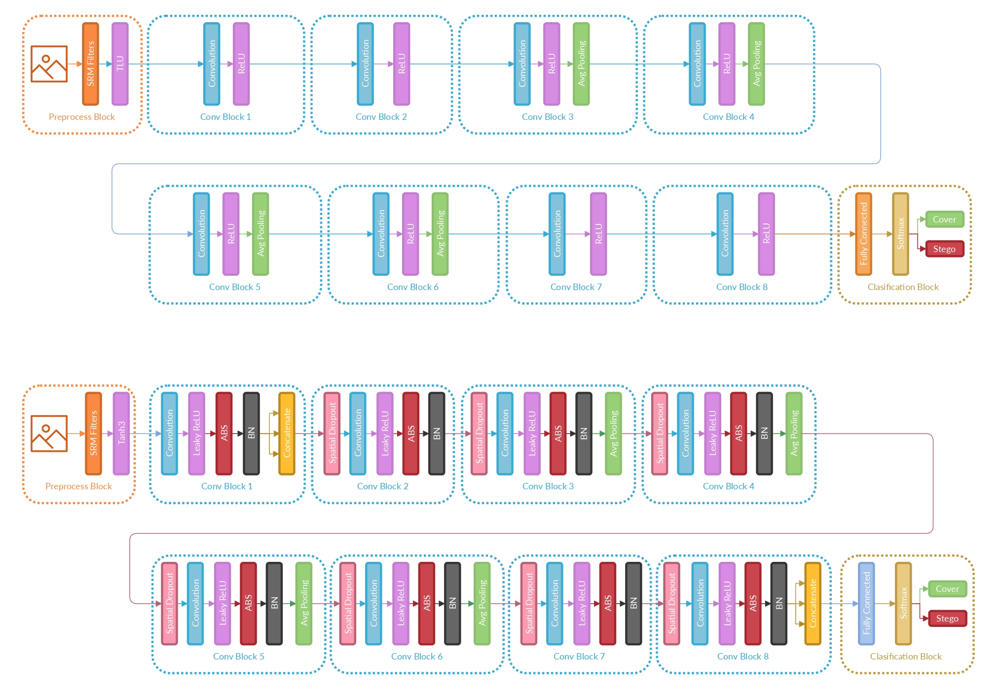

# Strategy to improve the accuracy of convolutional neural network architectures applied to digital image steganalysis in the spatial domain

 In recent years, Deep Learning (DL) techniques applied to steganalysis have surpassed the traditional two-stage approach by unifying feature extraction and classification in a single model, the Convolutional Neural Network (CNN). Several CNN architectures have been proposed to solve this task, improving the detection accuracy of steganographic images, but it is not clear which computational elements are relevant. Here we present a strategy to improve accuracy, convergence, and stability during training. The strategy involves a preprocessing stage with Spatial Rich Models (SRM) filters, Spatial Dropout, Absolute Value layer, and Batch Normalization. Using the strategy improves the performance of three steganalysis and two image classification CNN's, by enhancing the accuracy from 2% up to 10% while reducing the training time to less than 6 hours and improving the networks' stability. 

The architecture in the top represents original Ye-Net, the one in the bottom   represents the architecture using the strategy 

## Folders

- **CNNs and SRM filters** This folder contains the notebooks Xu-Net, Ye-Net, Yedroudj-Net, Vgg16Stego, and Vgg19Stego architectures for steganographic images in the spatial domain. Also, it contains the SRMfilters.npy, which are used in the feature extraction stage of CNNs.

## Files

 - **YeNet.jpg** Comparison of Ye-Net architecture with and without the strategy.
 
## requirements
This repository requires the following libraries and frameworks:

- TensorFlow 
- numPy 
- OpenCV 
- Matplotlib
- time
- random
- os

This repository was developed in the Python3 (3.8) programming language.

## Databases

The data set used to reproduce the results can be downloaded from this <a href="https://drive.google.com/drive/folders/1G5vdhW11_qKfVC6W8_pfJpstVkXUk1QQ?usp=sharing">link</a>. Images taken from: <a href="http://agents.fel.cvut.cz/boss/index.php?mode=VIEW&tmpl=materials">BOSS competition</a> and <a href="http://bows2.ec-lille.fr/index.php?mode=VIEW&tmpl=index1">BOWS2</a>.
